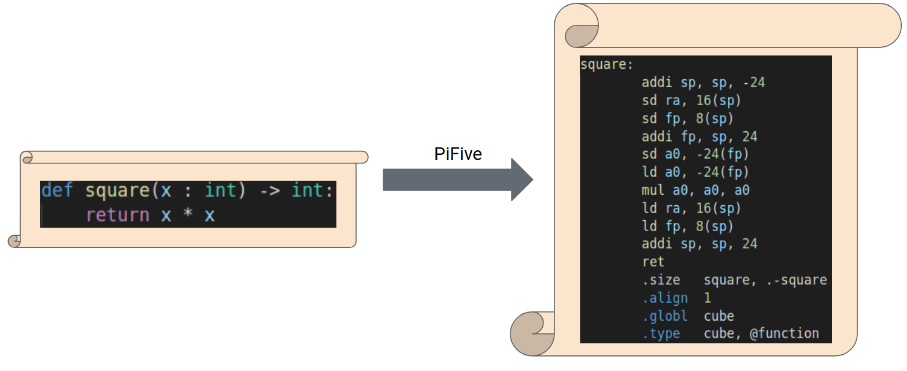

# PiFive - The Python to RISC-V Transpiler

## Table of Contents
* [Overview](#overview)
* [Defining the Subset of Python](#pythonSubset)
* [Software Setup / Compiling for Real Hardware](#setup)
* [References & Source Material](#references)

<a name="overview"></a>
## Overview

PiFive translates a sub-set of python source code to RISC-V assembly language.



Throughout the semester I will be organizing the project using Trello a software organization tool; a link to that board can be found [here](https://trello.com/b/26kdfMJz/senior-project). In addition, I will be updating a slide deck to organize my thoughts and build towards the final presentation; a link to that slide deck can be found here [here](https://docs.google.com/presentation/d/1rj_9L3pqZ0XZLCmFNdeaLof7cu6qTt5_TXOBURj3eK4/edit#slide=id.g113c484dce6_0_274).

<a name="pythonSubset"></a>
## Defining the Subset of Python 

Making a fully compliant Python-to-RISC-V transpiler in a semester is an infeasible goal for myself. In other words, a transpiler that could take in any valid Python script and output RISC-V assembly is probably not doable (by myself) in this time-frame because of all the glorius syntactic-sugar that Python allows. It natrually follows that I have decided to utilize a subset of Python, but how does one define a subset? In other words, what notation can be utilized to tersely express what `PiFive` does.

Normally, one would define the language using a grammar (for example, utilizing a Backus-Naur-like form), this is especially useful when we are writing the lexer/parser from scratch. However, the Python [ast module](https://docs.python.org/3/library/ast.html) already handles lexing/parsing for us. Hence, the focus of this project isn't so much building or even populating the abstract syntax tree (ast), but instead deciding what to do with each node as it is visited in the tree. To digress slightly, if we use the `ast` module to parse a python script which utilizes a class, but we have not implmented a way to translate classes to assembly, then we will need to throw an exception. First, we need to concretely define which features we will use.

There is a convenient notation utilized by the `ast` module called Abstract Syntax Description Language (ASDL). The ASDL for the full version for Python can be found [here](https://docs.python.org/3/library/ast.html). Amazingly, it expresses all of Python in less than 150 lines of text. It reads very much like a typical grammar, but instead of glancing from the level of syntax/characters (as a normal grammar does), we view the language at a higher, more abstract level; namely, the level of the nodes themselves. 

It is an especially helpful reference when debugging as well, because the names used in the `ASDL` are the names one can find in the Python debugger when visiting each node in the `ast`. For example, suppose we had the following python syntax as input:

```python
def square(x : int) -> int:
    return x * x
```

The first node in the `ASDL` we would encounter using a debugger would be `ast.Module` followed by `ast.FunctionDef` followed by `ast.Return`, etc. As one steps through the debugger and references the `ASDL`, it begins to make sense how the parser has put together the tree.

In order to define which subset of Python will be utilized we will simply define an simpler `ASDL` for ourselves.

Looking again at the definition of `square()`, we may notice the two `int`'s, one inside the parenthesis, and another after the "`->`". If you are only a little bit familiar with Python this may look odd. These are optional annotations allowed in Python syntax. In practice, they give the programmer more information about types. For example, in the case of `square()`, the `int` after the "`:`" tells us that `x` is an integer, whereas the `int` after the "`->`" tells us that `square()` returns an integer.

Though, in practice annotations may be used for: giving the programmar more information, making autocomplete better, and perhaps compiler optimization, we will be using them to make `PiFive` strongly-typed. In other words, if we do not find these annotations for `ast.FunctionDef` and `ast.AnnAssign` nodes, then an exception will be thrown.

`PiFive`'s ASDL (subject to improve if time allows):

```python
module Python
{
    mod = Module(stmt* body, type_ignore* type_ignores)

    stmt = FunctionDef(identifier name, arguments args,
                       stmt* body, expr* decorator_list, expr? returns,
                       string? type_comment)
          | Return(expr? value)

          | Assign(expr* targets, expr value, string? type_comment)
          | AugAssign(expr target, operator op, expr value)
          -- 'simple' indicates that we annotate simple name without parens
          | AnnAssign(expr target, expr annotation, expr? value, int simple)

          -- use 'orelse' because else is a keyword in target languages
          | For(expr target, expr iter, stmt* body, stmt* orelse, string? type_comment)
          | While(expr test, stmt* body, stmt* orelse)
          | If(expr test, stmt* body, stmt* orelse)

          | Expr(expr value)

          -- col_offset is the byte offset in the utf8 string the parser uses
          attributes (int lineno, int col_offset, int? end_lineno, int? end_col_offset)

          -- BoolOp() can use left & right?
    expr = BoolOp(boolop op, expr* values)
         | BinOp(expr left, operator op, expr right)
         | UnaryOp(unaryop op, expr operand)
         | Call(expr func, expr* args, keyword* keywords)
         | Constant(constant value, string? kind)

         -- the following expression can appear in assignment context
         | Attribute(expr value, identifier attr, expr_context ctx)
         | Name(identifier id, expr_context ctx)

          -- col_offset is the byte offset in the utf8 string the parser uses
          attributes (int lineno, int col_offset, int? end_lineno, int? end_col_offset)

    expr_context = Load | Store | Del

    boolop = And | Or

    operator = Add | Sub | Mult | MatMult | Div | Mod | Pow | LShift
                 | RShift | BitOr | BitXor | BitAnd | FloorDiv

    unaryop = Invert | Not | UAdd | USub

    cmpop = Eq | NotEq | Lt | LtE | Gt | GtE | Is | IsNot | In | NotIn

    arguments = (arg* posonlyargs, arg* args, arg? vararg, arg* kwonlyargs,
                 expr* kw_defaults, arg? kwarg, expr* defaults)

    arg = (identifier arg, expr? annotation, string? type_comment)
           attributes (int lineno, int col_offset, int? end_lineno, int? end_col_offset)
}
```

Nodes which might be added depending on time could be `ast.List`, `ast.Subscript`, `ast.Try`, `ast.ExceptHandler`, & `ast.Import`.

<a name="references"></a>
## References & Source Material

There are several references that I will place here which are either instructional or relevent in some way.

\<Reference Type\> : \<Description\> : \<Link(s)\>

1. *Website* : The original project that spawned the idea for this project *Compiling Python syntax to x86-64 assembly for fun and (zero) profit*] : [blog post](https://benhoyt.com/writings/pyast64/https://my.url.com) + [open source project](https://github.com/benhoyt/pyast64).
2. *Website* : Python ast module : [latest](https://docs.python.org/3/library/ast.html)
3. *Document* : HiFive Unmatched Software Reference Manual : [manual](https://www.sifive.com/boards/hifive-unmatched)
4. *Document* : RISC-V Specification document : [spec](https://riscv.org/technical/specifications/)
5. *Book* : RISC-V Assembly Language, Anthony J. Dos Reis
6. *Book* : The RISC-V Reader, Patterson & Waterman 
7. *Book* : Computer Architecture A Quantitative Approach, Patterson & Hennessy Computer Architecture A Quantitative 
8. *Book* : Engineering A Compiler, Cooper & Torczon
9. *Website* : Python to C++ transpiler : [link](https://github.com/lukasmartinelli/py14) 

<a name="setup"></a>
## Software Setup

Aside from Python 3.9.7+, there are no software requirements in order to run this project. However, one of the goals of this project is for the output assembly from `PiFive` to be compiled down to a raw executable which can be run on real hardware (i.e. HiFive Unmatched). If you only care about seeing the assembly output from PiFive, then this step is unnecessary, however if you either have the HiFive Unmatched, or are just intereseted in seeing how the assembly can be compiled to an executable, then you can follow these steps to install the compiler:

A prebuilt version of the compiler can supposedly be found [here](https://toolchains.bootlin.com/releases_riscv64.html), though I have personally gone the compile-from-source route. Full instructions and explanations on compiling from source can be found in reference [3], but the following may be sufficient: 

First, install the source in a directory

```bash
$ mkdir x-tools
$ cd x-tools
$ git clone https://github.com/crosstool-ng/crosstool-ng
$ cd crosstool-ng
```
Next, build the tool
```bash
mkdir rv64gc-linux-gnu
cd rv64gc-linux-gnu
ct-ng riscv64-unknown-linux-gnu
ct-ng build
cd ..
```

To test if everything works, write a simple hello world program and compile:

```bash
$ ~/x-tools/riscv64-unknown-linux-gnu/bin/riscv64-unknown-linux-gnu-gcc ./hello.c -o
hello
```

To see the output of how gcc translates `hello.c` to assembly use the following: 
```bash
$ ~/x-tools/riscv64-unknown-linux-gnu/bin/riscv64-unknown-linux-gnu-gcc -S hello.c -o hello.s
```
This is especially helpful for learning some RISC-V assembly and also checking to see if the output of `PiFive` is close to what is expected.

Finally, in order to compile an assembly file down to a raw executable use the following:

```bash
~/x-tools/riscv64-unknown-linux-gnu/bin/riscv64-unknown-linux-gnu-as hello.s -o example
```

Note that this program will only run on native hardware. You can however generate an assembly listing from the binary file using the following command:

```bash
$ ~/x-tools/riscv64-unknown-linux-gnu/bin/riscv64-unknown-linux-gnu-objdump -DS ./hello
>& hello.lst
``` 